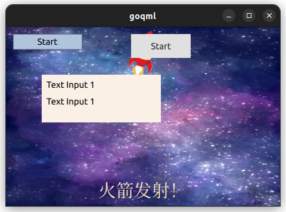
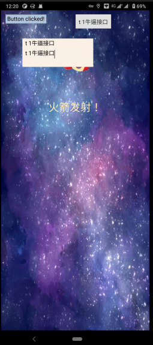

# Qt Quick使用样例

本项目基于`Qt5.12.12`，`QtQuick 2.12`

## QML
- [教程](https://cwc1987.gitbooks.io/qmlbook-in-chinese/content/)
- [PDF教程](https://pan.baidu.com/s/1dDnqMXV)

形如
```qml
Window {
    id:root;        // Window元素的id，应该保证在这个qml文件中名字唯一
    visible: true;
    width: 460;     // 直接指定窗口的宽度
    height: 300;    // 直接指定窗口的高度

    Image {
        id: bg;
        width: parent.width;            // 图片的宽度依赖父窗口的宽度
        height: parent.height;          // 图片的高度依赖父窗口的高度
        source: "qrc:///images/sky.jpg" // 引用一张图片
    }
    Button {
        id: button_CMdle
        x: 210; y: 12
        text: "Start"
    }
}
```
的元素描述语言。当然，其中可以可以可写`function`。关于其特色的显示区域和操控区域相互分离也很新鲜，宗旨——很是强大。
就像这样:
```qml
import QtQuick 2.0

Rectangle {
    width: 320
    height: 480
    ListView {
        id: view
        anchors.fill: parent
        delegate: Thumbnail {
            width: view.width
            text: modelData.title
            iconSource: modelData.media.m
        }
    }

    function request() {
        var xhr = new XMLHttpRequest();
        xhr.onreadystatechange = function() {
            if (xhr.readyState === XMLHttpRequest.HEADERS_RECEIVED) {
                print('HEADERS_RECEIVED')
            } else if(xhr.readyState === XMLHttpRequest.DONE) {
                print('DONE')
                var json = JSON.parse(xhr.responseText.toString())
                view.model = json.items
            }
        }
        xhr.open("GET", "http://api.flickr.com/services/feeds/photos_public.gne?format=json&nojsoncallback=1&tags=munich");
        xhr.send();
    }

    Component.onCompleted: {
        request()
    }
}
```
## QML & C++
[参考于此](https://www.cnblogs.com/linuxAndMcu/p/11961090.html)，还有很多精彩可以挖掘，按需取用。

### C++
需要继承`QObject`, 并使用`Q_OBJECT`宏:

- Q_PROPERTY 可以方便在QML中调用, 并可以定义监控方法
```cpp
#ifndef CMOUDLE_H
#define CMOUDLE_H

#include <QObject>

class CMoudle : public QObject
{
    Q_OBJECT

    // 注册，使之可以在QML中调用
    Q_PROPERTY(QString name READ getName WRITE setName NOTIFY nameChanged)

public:
    explicit CMoudle(QObject *parent = nullptr);
    // name some1
    void setName(const QString &name);
    QString getName() const;

signals:
    // name some2
    void nameChanged(const QString name);

public slots:
    void println(QString text);

private:
    // 类私属性
    // name some3 other
    QString myName;
};

#endif // CMOUDLE_H
```

- 需要在`main.cpp`中向qml注册
```cpp
// 参数：qmlRegisterType<C++类型名> (import时模块名 主版本号 次版本号 QML中的类型名)
qmlRegisterType<CMoudle>("CMoudle.moudle", 1, 0, "CMdle");
```

- QML中信号可以调用槽和信号
- 在QML中可以使用Connections连接两方方法
- 在XML中，使用Q_PROPERTY 定义的`NOTIFY`会有一个`onXXXXXX`Function
```qml
    Connections {
        target: button_CMdle
        onPressed: {
            console.log("fuck?");
            cmdle.println(input1.text);
            // cmdle.nameChanged("niubia") // 无错误，但这么单独使用并无作用
        }
        onReleased: {
            cmdle.name = input1.text
        }
    }
```

通过以上方式已经可以完成双方互操作。

## Example
如果有兴趣可以看看下面不好看的效果演示图

### 可操作部分

- 两个按钮皆可以点击
- 第二个按钮和C++交互了来回一圈，有debug和console日志
- 两个Input可以输入文字
- 第二个input在焦点切换时会与第一个input text同步
- "火箭发射"文字可以点按，火箭消失/出现
- 火箭有动画

### Desktop

### Mobile
